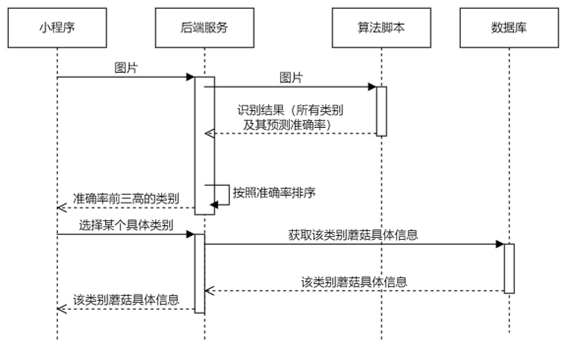

# mushroom
基于卷积神经网络的蘑菇识别微信小程序（“识菇”）
## 项目描述
本项目是基于SpringBoot和图像分类算法用来识别蘑菇的微信小程序，根据拍摄上传的蘑菇图片，通过python脚本调用训练好的模型，经过后端处理，最后返回识别结果的类别及其识别准确率。

## 技术亮点
 - 采用**MobileNetV2**进行作为蘑菇图像分类的特征提取网络，使模型轻量化，使得参数量减少了60%，加快访问速度
 - 通过@ControllerAdvice注解实现拦截器，利用@ExceptionHandler注解捕捉所有异常，进行统一处理
 - 为提升查询效率，在蘑菇学名字段上建立了索引
 ## 1.1 总体设计

介绍了小程序的整体系统架构以及使用小程序进行蘑菇识别的流程。

### 1.1.1      系统架构

小程序采用前后端分离架构，前端采用taro框架，后端采用springboot框架，并通过nginx进行请求转发。

​                               

### 1.1.2      识别流程

使用小程序对蘑菇进行识别时，小程序会向后端发起请求，后端再调用python脚本进行识别，并从数据库查询蘑菇具体信息。

 

## 1.2 算法实现

介绍了蘑菇识别算法采用的数据集，识别算法的设计与实现，以及算法的识别效果与所做的改进。

### 1.2.1      数据集

在kaggle获取，地址： 

https://www.kaggle.com/datasets/maysee/mushrooms-classification-common-genuss-images

该数据集中有9个最常见的北欧蘑菇属图像文件夹。每个文件夹包含300到 1500个蘑菇属的选定图像。标签是文件夹的名称。

 

 

### 1.2.2      算法设计与实现

处理数据集：用tensorflow.image.decode_jpeg和tensorflow.image.resize 对图片进行标准化。

训练：将图片与标签（文件夹名即标签）打包后，将前百分之80设置为训练集，后百分之20设置为验证集。利用tf.keras.Sequential构建模型model，最后调用model.fit进行训练。

识别：利用tf.keras.Sequential构建模型model，并调用

model.load_weights加载训练好的模型，最后调用model.predict进行预测。

### 1.2.3      识别结果与改进

训练集准确率：98.53%，测试集准确率：72.32%。

 ****

 

可以发现这个结果很不理想。一开始我以为是因为过拟合了，**于是尝试增加****dropout****，但发现并没有起到什么作用**[[张1\]](#_msocom_1) **。**

于是我去看了看数据集中的数据，发现有很多图片是脏数据，比如：

 

之后我对这些脏数据进行了手动删除，同时我发现图片中干扰元素较多（比如背景中的花草），可能会导致网络无法很好地对蘑菇进行分类。于是我尝试使用了github上的开源库https://github.com/nadermx/backgroundremover 对数据集中的数据进行去背景处理。

去背景脚本：遍历原图片，对当前图片执行 os.system('backgroundremover -i "'+original_file+'" -o "'+new_file+'"')命令进行去除图片操作，并将结果存入另一个文件下。

去背景前：

 

去背景后：

 

最后使用去除了脏数据，并进行了去背景操作后的数据集进行训练，训练集准确率：99.88%， 测试集准确率：81.25%。

 

 

## 1.3 应用实现

介绍了小程序应用数据库、后端、前端的设计与实现。

### 1.3.1      数据库

采用Mysql数据库。由于系统比较简单，只有一张表：mushroom。

mushroom表字段：id（主键），name（蘑菇名称），scientific_name （学名），species（所属科属），toxicity（毒性），feature（特征），文献（documents），img_path（图片路径）。

其中为提升查询效率，在scientific_name字段上建立了索引。

### 1.3.2      后端

用springboot框架进行开发，用mybatis-plus框架进行数据库交互。

核心接口逻辑：将前端传过来的图片上传至服务器指定路径下-->利用Runtime.getRuntime().exec(command)执行python命令：python identify.py <图片路径>（python脚本读取该路径下的图片进行识别）--> 读取python脚本打印出来的结果（所有类别及其识别准确率），并进行排序-->删除上传至服务器的图片-->返回识别准确率前三的类别。

统一错误处理：通过@ControllerAdvice注解实现一个拦截器，并利用@ExceptionHandler(value = Exception.class)注解捕捉所有异常，进行统一处理。

### 1.3.3      前端

基于Taro（React）框架进行开发。

上传图片：使用Taro.chooseImgae api选择图片，选择成功后调用Taro.uploadFile api将图片上传至服务器。

页面间传递对象参数：父页面调用Taro.eventCenter.trigger api触发事件，将参数放入事件中。子页面调用Taro.eventCenter.once api监听事件，取得参数。

获取蘑菇详细信息：通过Taro.request api调用后端接口获取详细信息。

## 1.4 部署与发布

介绍了小程序开发完成后的部署与发布。

### 1.4.1      服务器配置

操作系统：CentOS 7.6 64位（腾讯云云服务器）

CPU：1核2GB

系统盘：50GB

域名：www.runtohelp.top

ssl证书：

 

### 1.4.2      后端部署

将ssl证书上传至服务器，并修改nginx配置文件：

 

将后端springboot项目通过maven打包成.jar文件，并上传至服务器。

执行命令：nohup java -jar ../mushroom-0.0.1-SNAPSHOT.jar > ../log.txt &启动服务。

### 1.4.3      小程序发布

通过微信小程序开发工具上传代码，并在小程序管理后台进行发布。目前小程序已发布，在微信中搜索识菇即可进行使用。

## 1.5 效果展示

使用“识菇”微信小程序进行蘑菇识别的效果如下：

 
 
 
 
 
图3.18 点击某一个类型可跳转至详情页面，查看该类别蘑菇详细信息

